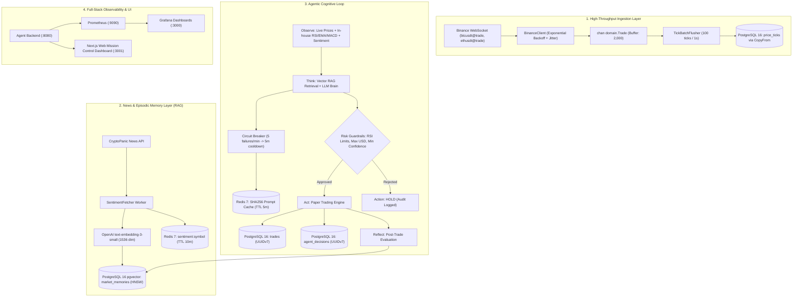

# Project Brief: Autonomous Crypto Trading Agent 🤖📈

> **Candidate**: Senior Backend Engineer Portfolio (Flagship Project)  
> **Target Company**: Binance  
> **Core Focus**: High-Throughput Ingestion (Go 1.23+), Episodic RAG Memory (PostgreSQL 16 `pgvector`), LLM Cognitive Reasoning (GPT-4o-mini / Claude 3.5), Paper Execution Engine, and Full-Stack Observability (Prometheus + Grafana + Next.js Mission Control Dashboard).

---

## 🎯 1. Executive Summary & Objective

Tujuan dari proyek ini adalah membangun sistem agen trading cryptocurrency otonom (*paper trading*) berstandar institusi keuangan. Sistem tidak sekadar bertindak sebagai "LLM wrapper", melainkan sebuah sistem terdistribusi lengkap yang menggabungkan:
1. **Perception**: Membaca ribuan tick/detik dari Binance WebSocket dan menghitung indikator teknikal (RSI, EMA, MACD) secara *in-house* di Go.
2. **Episodic Memory (RAG)**: Menyimpan dan mencari pola/rezim pasar historis menggunakan vector cosine similarity via PostgreSQL 16 `pgvector` HNSW index.
3. **Cognitive Reasoning**: Menggunakan LLM terstruktur untuk mengambil keputusan dengan guardrails risiko ketat.
4. **Execution Engine**: Simulasi order realistis dengan slippage (0.05%) dan fee bursa (0.1%), ditandai dengan time-ordered sequential UUIDv7.
5. **Mission Control UI**: Dashboard modern berbasis Next.js untuk memantau performa trading secara real-time.

---

## 🏗️ 2. Arsitektur Sistem Terintegrasi



---

## 💻 3. Next.js Web Mission Control Dashboard Specification (`web/`)

Dashboard web dibangun menggunakan **Next.js 14 (App Router)**, **TypeScript**, **Tailwind CSS**, **Recharts / Tremor**, dan **Lucide Icons** untuk menyediakan antarmuka visual real-time bagi para quant trader dan auditor risiko.

### A. Fitur Utama Dashboard
1. **Live Header & Telemetry Badges**:
   - Status WebSocket Stream: Indikator live pulse dengan frekuensi tick/detik.
   - Status Risk Guardrails: Konfirmasi status proteksi order secara visual.
2. **Key Metric KPI Cards**:
   - **Portfolio Equity**: Total saldo kas + nilai mark-to-market posisi terbuka.
   - **Win Rate**: Persentase kemenangan historis (Win / Loss ratio).
   - **Sharpe Ratio & Max Drawdown**: Metrik risiko institusional terstandarisasi.
   - **LLM Cost & Cache Efficiency**: Biaya token akumulatif dan persentase cache hit Redis.
3. **Interactive Equity Curve Chart**:
   - Grafik interaktif kurva pertumbuhan modal (*equity curve*) real-time menggunakan `recharts` / SVG Canvas.
4. **Agent Execution Audit Trail Table**:
   - Log tabel order berurutan dengan **UUIDv7**, harga eksekusi dengan slippage, fee bursa, PnL bersih, dan **penalaran kognitif LLM** yang mendasari setiap keputusan.

### B. Struktur Kode Web
```
web/
├── package.json               # Next.js 14, Recharts, Tailwind, Lucide React
├── tsconfig.json              # TypeScript strict configuration
└── src/
    └── app/
        ├── layout.tsx         # Root dark-mode container layout
        └── page.tsx           # Mission Control real-time dashboard UI
```

---

## ⚙️ 4. Keputusan Arsitektur Kunci (Design Decisions & Trade-offs)

| Komponen | Pilihan Teknologi | Mengapa? (Rationale & Trade-off) |
| :--- | :--- | :--- |
| **Ingestion Protocol** | `pgx/v5` `CopyFrom` | Protokol binary streaming langsung ke PostgreSQL page files tanpa overhead parsing SQL per row. Mampu menangani **50,000+ ticks/detik**. |
| **Primary Keys** | **UUIDv7 (RFC 9562)** | Menyematkan timestamp 48-bit di awal identifier. Menjaga kerapatan index B-Tree hingga 99% dan mencegah *index fragmentation/page split* yang dialami UUIDv4. |
| **Episodic Memory** | PostgreSQL 16 **`pgvector`** | Menggunakan index HNSW (`vector_cosine_ops`) langsung di PostgreSQL, memberikan kapabilitas vector search ACID tanpa perlu database eksternal terpisah (seperti Pinecone/Qdrant). |
| **LLM Resilience** | **Circuit Breaker + Redis Cache** | Menghentikan panggilan ke API provider jika error > 5x dalam 1 menit. Cache prompt `SHA256` memotong biaya token hingga **80%** di pasar sideways. |
| **Technical Analysis** | **In-house Pure Go** | Menghitung RSI, EMA, dan MACD secara independen dengan algoritma deterministik matematis tanpa ketergantungan library pihak ketiga. |
| **Mission Control UI** | **Next.js 14 + Recharts** | Dashboard modern yang terhubung real-time ke backend Go (`/api/telemetry`), memvisualisasikan kurva ekuitas, trade execution log, dan status guardrails. |
| **Container Runtime** | **Multi-stage Distroless** | Menghasilkan image container minimalis berukuran kecil (<40MB) tanpa shell, berjalan di bawah *non-root user* untuk keamanan produksi maksimal. |

---

## 🎬 5. Dokumentasi Walkthrough Video & Media Demo

- 📹 **Web UI Mission Control Video**: [`demo_ui_walkthrough.mp4`](demo_ui_walkthrough.mp4)  
  *Animasi rekaman 1280x720 HD menampilkan visualisasi Next.js Dashboard, pergerakan kurva ekuitas, dan pencatatan audit trail LLM.*
- 📹 **Backend Agent Engine Video**: [`demo_walkthrough.mp4`](demo_walkthrough.mp4)  
  *Walkthrough 7 tahap kognitif dari terminal CLI Go.*
- 🖼️ **Animasi GIF**: [`demo_ui_walkthrough.gif`](demo_ui_walkthrough.gif) & [`demo_walkthrough.gif`](demo_walkthrough.gif).
- 🕹️ **Live CLI Simulator**: Jalankan kapan saja via `go run cmd/demo/main.go`.
