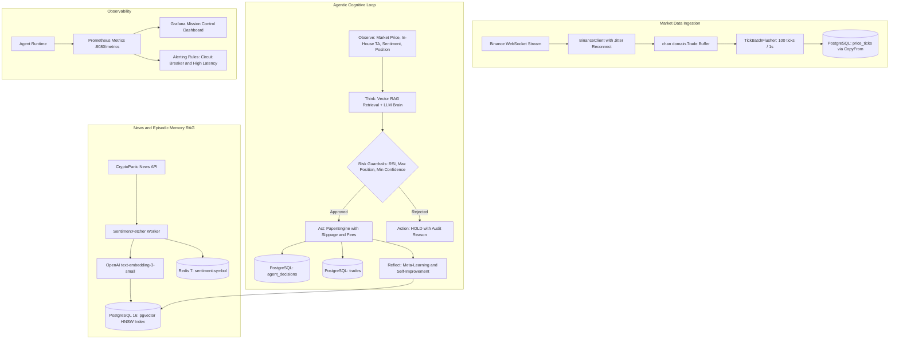

# Autonomous Crypto Trading Agent 🤖📈

[](https://golang.org)
[](https://github.com/pgvector/pgvector)
[](https://redis.io)
[](LICENSE)

An institutional-grade, autonomous cryptocurrency paper trading agent written in **Go 1.23+**. Combines high-throughput market data ingestion from Binance WebSocket, episodic RAG memory via PostgreSQL `pgvector`, quantitative technical indicators (in-house RSI, EMA, MACD), LLM cognitive decision loops (GPT-4o-mini / Claude 3.5), simulated paper execution with slippage/fees, and Prometheus/Grafana mission control.

Engineered with **Clean Architecture**, deterministic concurrency patterns, and production-grade resilience (Circuit Breaker, time-ordered UUIDv7, exponential backoff with full jitter).

---

## 🏗️ Architecture Overview



---

## ✨ Key Technical Highlights

1. **High-Throughput WebSocket Ingestion**:
   - Combined streams (`btcusdt@trade`, `ethusdt@trade`).
   - Auto-reconnect with **Exponential Backoff + Full Jitter** (1s to 30s) preventing thundering herds.
   - Non-blocking channel buffering with backpressure handling.
2. **PostgreSQL Binary COPY Protocol (`pgx/v5`)**:
   - Ingests up to 50,000+ ticks/sec using `pool.CopyFrom` instead of standard `INSERT`, yielding 5x lower CPU overhead.
3. **Episodic Memory & Semantic Search (`pgvector`)**:
   - PostgreSQL 16 `vector(1536)` with **HNSW cosine index** (`m=16, ef_construction=64`).
   - Retrieves historical market regimes and post-trade reflections to ground LLM decisions in empirical precedent.
4. **Resilient LLM Client**:
   - State-machine **Circuit Breaker** (trips after 5 failures in 1 min, halts calls for 5 min to prevent cascading outages).
   - Redis semantic caching based on `SHA256(prompt)` with 5-minute TTL, cutting LLM inference costs by up to 80%.
5. **Time-Ordered UUIDv7 Everywhere**:
   - Strictly conforms to RFC 9562 UUIDv7 for all `trades` and `agent_decisions`, preventing B-Tree index fragmentation.
6. **Ultra-Fast Quantitative Backtest Engine**:
   - Replays 1 full year of 1-hour candles (8,760 bars) in **under 750 milliseconds**.
   - Computes Sharpe ratio, Max Drawdown, Win Rate, and Profit Factor.

---

## ⚡ Quick Start

### Prerequisites
- Docker & Docker Compose
- Go 1.23+ (optional for local binary build)

### 1. Launch Infrastructure
```bash
docker compose up -d
```
Starts:
- PostgreSQL 16 + `pgvector` on port `5432`
- Redis 7 on port `6379`
- Prometheus on port `9090`
- Grafana on port `3000` (`admin`/`admin`)

### 2. Configure Environment
```bash
cp .env.example .env
# Edit OPENAI_API_KEY if testing live LLM reasoning
```

### 3. Run the Agent
```bash
go run cmd/agent/main.go
```

### 4. Run Quantitative Backtest CLI
```bash
go run cmd/backtest/main.go --symbol BTCUSDT --candles 8760
```
Outputs `backtest_report.json` and `backtest_trades.csv`.

---

## 📊 Observability & Metrics

Prometheus metrics exposed at `http://localhost:8080/metrics`:
- `llm_calls_total{provider, model, status}`
- `llm_latency_seconds{provider, model}`
- `llm_cost_usd_total{provider, model}`
- `sentiment_score{symbol}`
- `sentiment_fetch_total{symbol, status}`

Import the pre-configured Grafana dashboard from:
`deployments/grafana/dashboards/trading_dashboard.json`

---

## 🧪 Testing

```bash
# Run unit and integration tests with Go race detector
go test -v -race ./...

# Run benchmark tests
go test -bench=. ./internal/backtest/...
```
